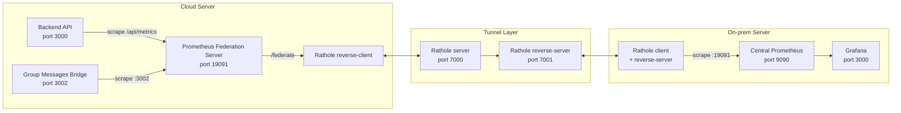
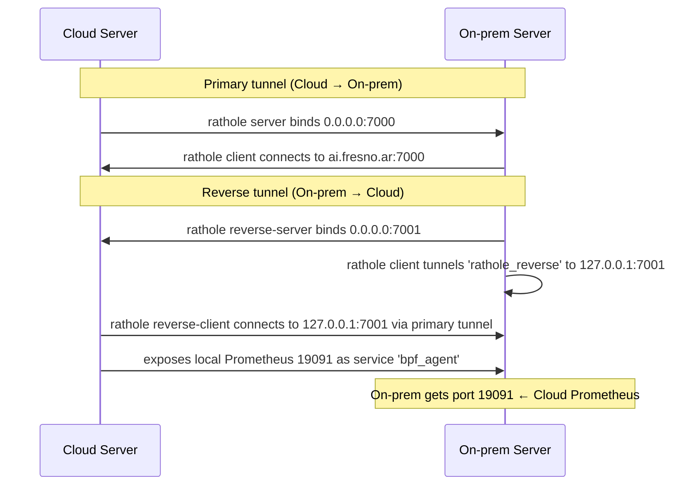

# Observability Architecture

## Components

| Component | Location | Role |
|---|---|---|
| **Backend API** | Cloud Server | Exposes `/api/metrics` on port 3000 |
| **Group Messages Bridge** | Cloud Server | Exports Prometheus metrics on port 3002 |
| **Prometheus Federation Server** | Cloud Server | Scrapes backend & bridge, re-exposes via `/federate` on 19091 |
| **Rathole Tunnel** | Both servers | Bidirectional encrypted tunnel between servers |
| **Central Prometheus** | On-prem Server | Scrapes federated endpoint, stores long-term |
| **Grafana** | On-prem Server | Dashboards and visualization |

---

## Data Flow



---

## Rathole Bidirectional Tunnel

The connection between the two servers uses a **crossed rathole** architecture:



### Service Details

| Direction | Service | Cloud binds | On-prem sees |
|---|---|---|---|
| Cloud → On-prem | `rathole_reverse` | `server.toml` service | `127.0.0.1:7001` |
| On-prem → Cloud | `bpf_agent` | `reverse-client.toml` | `127.0.0.1:19091` |

The On-prem Prometheus scrapes `host.docker.internal:19091`, which is served by the On-prem's local rathole reverse-server. That tunnel reaches the Cloud Server's reverse-client, which connects to the Cloud Server's local Prometheus container on port 19091.

---

## Prometheus Federation Server (Cloud Server)

The Cloud Server runs a **traditional Prometheus Server** (not Agent mode) with:

- **Scrape configs**: backend (`/api/metrics`) and bridge (`:3002`)
- **Retention**: minimized to 30m to avoid disk bloat
- **Federation endpoint**: `/federate` on port 19091
- **No remote_write**: all data flows through federation

### Configuration

File: `monitoring/prometheus.yml` on the bpf-application repo.

```yaml
global:
  scrape_interval: 15s

scrape_configs:
  - job_name: 'bpf-groups-bridge'
    scrape_interval: 30s
    static_configs:
      - targets: ['group-messages-bridge:3002']
  - job_name: 'bpf-application-backend'
    scrape_interval: 30s
    metrics_path: /api/metrics
    static_configs:
      - targets: ['backend:3000']
```

### Docker Compose Flags

```
--config.file=/etc/prometheus/prometheus.yml
--storage.tsdb.path=/prometheus
--storage.tsdb.retention.time=30m
--web.listen-address=0.0.0.0:19091
--web.enable-lifecycle
```

Note: `--agent` flag is **not** present. The container publishes port 19091 to `127.0.0.1:19091` on the host for the rathole reverse-client to reach.

---

## Central Prometheus (On-prem Server)

The On-prem server runs Prometheus v3.3.1 as the central aggregation point. It scrapes local infrastructure (node_exporter, cadvisor, GPU, etc.) and the federated Cloud Server data.

The relevant scrape job for EasyCasual metrics:

```yaml
- job_name: 'bpf-cloud-agent'
  static_configs:
    - targets: ['host.docker.internal:19091']
```

This scrapes the rathole reverse-server on `host.docker.internal:19091`, which tunnels to the Cloud Server's Prometheus federation endpoint.

---

## Grafana

Grafana 12.4.3 runs on the On-prem server, connected to the local Prometheus as its data source. Dashboards are imported from the `dashboards/` directory in this repository.

---

## Why Federation Over remote_write?

| Aspect | remote_write (Agent mode) | Federation (Server mode) |
|---|---|---|
| Scraped data visible locally | No — `/metrics` shows only process metrics | Yes — full TSDB with scraped samples |
| Debuggable on Cloud Server | No — must check On-prem | Yes — query `/federate` or `/api/v1/query` |
| Survives tunnel drops | Samples lost until reconnect | Buffer in memory, re-exported on next scrape |
| Retention control | Central decides | Cloud Server keeps 30m buffer |
| On-prem can add filtering | No — raw samples | Yes — match[] selectors per job |
| On-prem can add relabeling | Limited | Full relabel config on the scrape job |

Agent mode was working for delivery but made debugging nearly impossible: when the tunnel dropped, there was no way to verify whether the Cloud Server Prometheus was scraping correctly without accessing the On-prem instance. Federation solves this while keeping the same rathole tunnel infrastructure.
